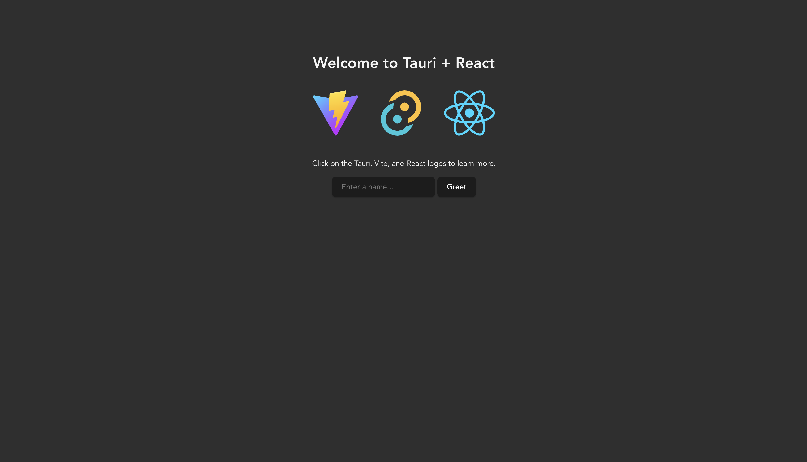

# Tauri + React + Typescript

This template should help get you started developing with Tauri, React and Typescript in Vite.

## Recommended IDE Setup

- [VS Code](https://code.visualstudio.com/) + [Tauri](https://marketplace.visualstudio.com/items?itemName=tauri-apps.tauri-vscode) + [rust-analyzer](https://marketplace.visualstudio.com/items?itemName=rust-lang.rust-analyzer)



## Requirements

Tauri compiles a native Rust binary, so a Rust toolchain is mandatory — the
frontend alone is not enough to produce an app.

### Rust

Installed via **rustup**, not Homebrew. Do not use `brew install rust`: it ships
a single fixed version with no target management, and Homebrew's `bin` sits
behind `~/.cargo/bin` on `PATH`, so a brew copy would be downloaded and then
silently bypassed.

```sh
curl --proto '=https' --tlsv1.2 -sSf https://sh.rustup.rs | sh -s -- -y --profile minimal
```

`--profile minimal` installs `cargo`, `rustc` and `rust-std` only — that is all
Tauri needs. Drop the flag if you also want `rustfmt` and `clippy`.

Add `cargo` to your shell. The installer does this automatically unless you pass
`--no-modify-path`; if `cargo` is not found in a new terminal, append this to
`~/.zshrc` yourself:

```sh
# Rust / cargo (required by Tauri)
. "$HOME/.cargo/env"
```

Then reload with `source ~/.zshrc`, or open a new tab. An already-open terminal
keeps its old `PATH` and will still fail.

Verify:

```sh
cargo --version    # cargo 1.97.1
rustc --version    # rustc 1.97.1
```

### Everything else

Already present on this machine — listed as the versions this project is known
to build against, not as things to install:

| Tool | Version | Notes |
| --- | --- | --- |
| macOS | 26.5.2 (arm64) | Apple Silicon |
| Xcode Command Line Tools | 26.6.0 | Supplies the linker. `xcode-select --install` if missing |
| Node.js | 24.10.0 | |
| pnpm | 11.13.1 | |
| Tauri CLI | 2.11.4 | Installed as a dev dependency; no global install needed |

Install JS dependencies once before either command below:

```sh
pnpm install
```

## Serve (development)

Runs the Vite dev server and the Tauri window together, with hot reload on the
frontend:

```sh
pnpm tauri dev
```

The first run compiles the Rust side in debug mode and takes a few minutes;
later runs are near-instant. Frontend edits reload without a recompile — only
changes under `src-tauri/` trigger one.

To work on the UI in a browser instead, without building the Rust binary:

```sh
pnpm dev          # http://localhost:1420
```

## Build for macOS

```sh
pnpm tauri build
```

This runs `pnpm build` first (via `beforeBuildCommand` in
`src-tauri/tauri.conf.json`), then compiles the Rust binary in release mode and
bundles it. Expect a few minutes on a cold build.

Two artifacts land in `src-tauri/target/release/bundle/`:

| Artifact | Path |
| --- | --- |
| App | `macos/tauri-tags-nextjs-rust-ts.app` |
| Installer | `dmg/tauri-tags-nextjs-rust-ts_0.1.0_aarch64.dmg` |

Open the built app with:

```sh
open src-tauri/target/release/bundle/macos/tauri-tags-nextjs-rust-ts.app
```

### Notes

**Architecture.** The build targets the host — `aarch64` here. For an Intel or
universal binary, add the target first:

```sh
rustup target add x86_64-apple-darwin
pnpm tauri build --target universal-apple-darwin
```

**Code signing.** The bundle is ad-hoc signed, with no Team ID. It runs fine on
the machine that built it, but Gatekeeper will block it on anyone else's — that
requires an Apple Developer ID and notarization.

**Windows.** Tauri cannot cross-compile a `.exe` from macOS. A Windows build
needs a Windows machine or a CI runner such as GitHub Actions `windows-latest`.