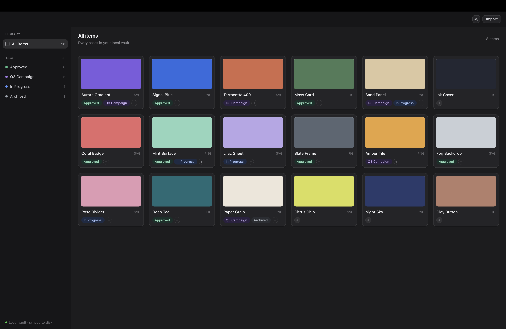

# Atlas — Collections & Tags

Technical assessment · **Track 1 — Web & Desktop** · Tauri 2 + React +
TypeScript + SQLite

A local-first design-asset library. Create named tags, assign them to assets,
filter by them, and have all of it survive a restart.

---

## Stack note — React + Vite, not Next.js

**Track 1 lists Next.js. This is built with React + Vite instead, deliberately.**

Next.js is not the standard frontend for Tauri 2. It can be made to work, but
only as a static export (`output: 'export'`) — and that switches off server-side
rendering, server components, middleware and API routes, which is the entire
reason to reach for Next.js. What survives is a single-page React app carrying
Next's build weight and routing constraints without any of its benefits.

The mismatch is structural rather than a matter of taste. A local-first desktop
app has no server to render on, and no HTTP layer at all: the frontend reaches
its data through Tauri IPC into Rust (`invoke`), not `fetch`. Rendering
strategy, request lifecycle and API routes — the problems Next.js exists to
solve — do not arise here.

Vite is what `create-tauri-app` scaffolds by default and what the Tauri docs
build against. It gives the same React + TypeScript surface, faster HMR, and a
plain static build that Tauri consumes directly.

Everything the track actually tests — TypeScript, React, component
architecture, state management, the Rust/IPC boundary — is exercised the same
way. If a Next.js web surface were later needed to share this UI on the web,
the components are plain React with no Vite-specific APIs, so they would move
across largely unchanged.

---

## Screenshots

### Part A — environment sanity check

`create-tauri-app` scaffold building and opening as a native macOS window,
before any feature work:


### Part B — Collections & Tags

The feature as built:



---

## Where each part lives

| Part | Deliverable | Location |
| --- | --- | --- |
| A | Scaffold + screenshot | [`docs/part-a-scaffold.png`](docs/part-a-scaffold.png) |
| B | Collections & Tags feature | [`src/components/library/`](src/components/library/), [`src/context/LibraryContext.tsx`](src/context/LibraryContext.tsx) |
| C | Fixed hook, annotated | [`fixes/`](fixes/) · ships at [`src/hooks/useTagFilter.ts`](src/hooks/useTagFilter.ts) |
| D1 | Schema + persistence | [`data/schema.sql`](data/schema.sql), [`src-tauri/src/db.rs`](src-tauri/src/db.rs), [`src/lib/db.ts`](src/lib/db.ts) |
| D2 | Sync design note | [`write_up.md`](write_up.md) |
| E | Async update + AI reflection | [`write_up.md`](write_up.md) |

### Feature notes

- **18 sample assets**, hardcoded as name + colour swatch in
  [`src/data/library.ts`](src/data/library.ts).
- **Tags** are created with a name and a colour, assigned to and removed from
  any asset, and deleted (hover a tag in the sidebar). Deleting cascades in
  SQLite, removing that tag from every asset.
- **Filtering** is single-select: click a tag to filter, click again or use the
  header chip to clear.
- **Both empty states** are covered — no tags created yet (sidebar prompt), and
  no assets matching the current filter. The seeded `Archived` tag has no
  assets, so the second state is reachable immediately by clicking it.
- **Dark mode** follows the OS by default, with a manual toggle.

### Architecture

```
React components
      │  (never call invoke directly)
      ▼
LibraryContext ──── useReducer cache: { tags, assignments }
      │             hydrated once at startup; optimistic writes with rollback
      ▼
src/lib/db.ts ───── the only module that touches Tauri IPC
      │  invoke()
      ▼
src-tauri/src/db.rs ── #[tauri::command] fns over Mutex<Connection>
      ▼
   SQLite (app-data dir)
```

There is no HTTP layer. The frontend cache is the source of truth for
rendering; SQLite is the source of truth for durability. Mutations apply to the
cache immediately and roll back if the Rust command rejects, so the UI never
waits on a round trip and never re-fetches the whole dataset.

---

## Requirements

Tauri compiles a native Rust binary, so a Rust toolchain is mandatory — the
frontend alone is not enough to produce an app.

### Rust

Installed via **rustup**, not Homebrew. Do not use `brew install rust`: it ships
a single fixed version with no target management, and Homebrew's `bin` sits
behind `~/.cargo/bin` on `PATH`, so a brew copy would be downloaded and then
silently bypassed.

```sh
curl --proto '=https' --tlsv1.2 -sSf https://sh.rustup.rs | sh -s -- -y --profile minimal
```

`--profile minimal` installs `cargo`, `rustc` and `rust-std` only — that is all
Tauri needs. Drop the flag if you also want `rustfmt` and `clippy`.

Add `cargo` to your shell. The installer does this automatically unless you pass
`--no-modify-path`; if `cargo` is not found in a new terminal, append this to
`~/.zshrc` yourself:

```sh
# Rust / cargo (required by Tauri)
. "$HOME/.cargo/env"
```

Then reload with `source ~/.zshrc`, or open a new tab. An already-open terminal
keeps its old `PATH` and will still fail.

Verify:

```sh
cargo --version    # cargo 1.97.1
rustc --version    # rustc 1.97.1
```

### Everything else

Already present on this machine — listed as the versions this project is known
to build against, not as things to install:

| Tool | Version | Notes |
| --- | --- | --- |
| macOS | 26.5.2 (arm64) | Apple Silicon |
| Xcode Command Line Tools | 26.6.0 | Supplies the linker. `xcode-select --install` if missing |
| Node.js | 24.10.0 | |
| pnpm | 11.13.1 | |
| Tauri CLI | 2.11.4 | Installed as a dev dependency; no global install needed |

Install JS dependencies once before either command below:

```sh
pnpm install
```

### Database

Nothing to install. Tags and their assignments are stored in **SQLite**, which
is compiled into the binary — `rusqlite` is built with the `bundled` feature, so
the app does not link against whatever `libsqlite3` happens to be on the
machine. There is no database server, no daemon, and no connection string.

The file is created on first launch at the OS app-data directory:

| Platform | Path |
| --- | --- |
| macOS | `~/Library/Application Support/com.prasannabiswas.tauri-tags-nextjs-rust-ts/library.db` |
| Linux | `~/.local/share/com.prasannabiswas.tauri-tags-nextjs-rust-ts/library.db` |
| Windows | `%APPDATA%\com.prasannabiswas.tauri-tags-nextjs-rust-ts\library.db` |

Print the resolved path — including any override — with:

```sh
pnpm db:path
```

The schema lives in [`data/schema.sql`](data/schema.sql) and is embedded into
the Rust binary with `include_str!`, so the checked-in file and the runtime
schema cannot drift apart. It is applied as `CREATE TABLE IF NOT EXISTS` on
every launch.

Populate starter tags with `pnpm seed` (see [Seeding](#seeding) below).

### Environment variables

Copy [`.env.example`](.env.example) to `.env` and edit. **The Tauri CLI does not
load `.env` into the Rust process** — only Vite reads it, and only for
`VITE_`-prefixed variables. The `ATLAS_*` variables must be exported into the
shell that launches the app:

```sh
set -a && source .env && set +a
pnpm tauri dev
```

Or prefixed inline for a single run:

```sh
ATLAS_DB_PATH=./dev.db pnpm tauri dev
```

| Variable | Effect |
| --- | --- |
| `ATLAS_DB_PATH` | Overrides the database location. Parent directories are created automatically. Unset uses the app-data path above |
| `ATLAS_SEED` | Any non-empty value seeds the database and exits without opening a window. Same as the `--seed` flag |

## Serve (development)

Runs the Vite dev server and the Tauri window together, with hot reload on the
frontend:

```sh
pnpm tauri dev
```

The first run compiles the Rust side in debug mode and takes a few minutes;
later runs are near-instant. Frontend edits reload without a recompile — only
changes under `src-tauri/` trigger one.

To work on the UI in a browser instead, without building the Rust binary:

```sh
pnpm dev          # http://localhost:1420
```

## Seeding

Starter tags and sample assignments are written by the Rust process, because
the database lives at an app-data path the app owns:

```sh
pnpm seed          # seed, then exit
pnpm dev:seeded    # seed, then start the app
```

Seeding is **idempotent** — it inserts only when the `tags` table is empty, so
running it twice adds nothing. To start over, delete the file and seed again:

```sh
rm "$(pnpm --silent db:path)"
pnpm seed
```

## Inspecting the database (TablePlus)

SQLite is a file, so "connecting" means opening that file — there is no host,
port, username or password to enter.

1. Copy the path:

   ```sh
   pnpm db:path | pbcopy
   ```

2. In TablePlus: **Create a new connection…** → choose **SQLite** → **Import
   from URL**, or click **Choose File** and paste the path with `Cmd+Shift+G`.
   Finder hides `~/Library` by default, which is why pasting the path beats
   browsing to it.
3. **Test** → **Connect**. You should see the `tags` and `item_tags` tables.

Or skip the GUI entirely, if you have the `sqlite3` CLI:

```sh
pnpm db:open              # opens a shell on the right file
# then, at the sqlite> prompt:
.tables
SELECT * FROM tags;
```

### Two things to watch for

**Foreign keys are per-connection, and off by default.** TablePlus and
`sqlite3` will not enforce the `ON DELETE CASCADE` on `item_tags` unless you
run this first — the app sets it on every connection it opens, but an external
client is a separate connection:

```sql
PRAGMA foreign_keys = ON;
```

Without it, deleting a tag by hand leaves orphaned rows in `item_tags`.

**The app does not watch the file.** The frontend keeps an in-memory cache that
it hydrates once at startup, so rows you edit in TablePlus will not appear until
you restart the app. Editing while the app is running is safe — SQLite locks
correctly — but the two views will disagree until then.

## Build for macOS

```sh
pnpm tauri build
```

This runs `pnpm build` first (via `beforeBuildCommand` in
`src-tauri/tauri.conf.json`), then compiles the Rust binary in release mode and
bundles it. Expect a few minutes on a cold build.

Two artifacts land in `src-tauri/target/release/bundle/`:

| Artifact | Path |
| --- | --- |
| App | `macos/tauri-tags-nextjs-rust-ts.app` |
| Installer | `dmg/tauri-tags-nextjs-rust-ts_0.1.0_aarch64.dmg` |

Open the built app with:

```sh
open src-tauri/target/release/bundle/macos/tauri-tags-nextjs-rust-ts.app
```

### Notes

**Architecture.** The build targets the host — `aarch64` here. For an Intel or
universal binary, add the target first:

```sh
rustup target add x86_64-apple-darwin
pnpm tauri build --target universal-apple-darwin
```

**Code signing.** The bundle is ad-hoc signed, with no Team ID. It runs fine on
the machine that built it, but Gatekeeper will block it on anyone else's — that
requires an Apple Developer ID and notarization.

**Windows.** Tauri cannot cross-compile a `.exe` from macOS. A Windows build
needs a Windows machine or a CI runner such as GitHub Actions `windows-latest`.

---

## What I'd do differently with more time

**Tests.** The gap I'd close first. There are none. The IPC contract was
verified with a throwaway script that called each command and checked the rows
it left in SQLite — that should be a real integration test using Tauri's mock
runtime, because the camelCase → snake_case argument mapping fails silently at
runtime rather than at compile time, and nothing currently stops a rename from
breaking it. The reducer in `LibraryContext` is pure and would be
straightforward to unit test, particularly the rollback path, which is the
least-exercised code in the app.

**Assets should come from disk.** They are hardcoded, which the spec allowed,
but it means `item_tags.item_id` points at array literals. Real imports need an
`assets` table and a file-watcher, and then the `item_id` foreign key I left out
becomes enforceable.

**Tag editing is incomplete.** You can create, assign, unassign and delete, but
not rename or recolour an existing tag. Delete also cascades with no undo and no
confirmation — for a destructive action that silently removes a tag from every
asset, it should at minimum say how many assignments it is about to take with
it.

**The cache hydrates once.** External edits — via TablePlus, or a second window
— won't appear until restart. The fix is emitting a Tauri event after each
mutation and having the frontend reconcile, which is also the groundwork the
sync design in `write_up.md` would need.

**Filtering is single-select.** Multi-tag filtering (AND/OR) is the obvious next
step, along with search, which I removed from the toolbar rather than ship a
non-functional control.

**Accessibility got partial attention.** Interactive elements have labels and
the tag chip's remove button is keyboard-reachable, but I haven't tested the app
with VoiceOver, and the card menu doesn't trap focus or close on Escape.

**Distribution.** The bundle is ad-hoc signed, so it only runs on the machine
that built it. Shipping to anyone else needs a Developer ID and notarization,
and ideally a CI job producing signed universal binaries.